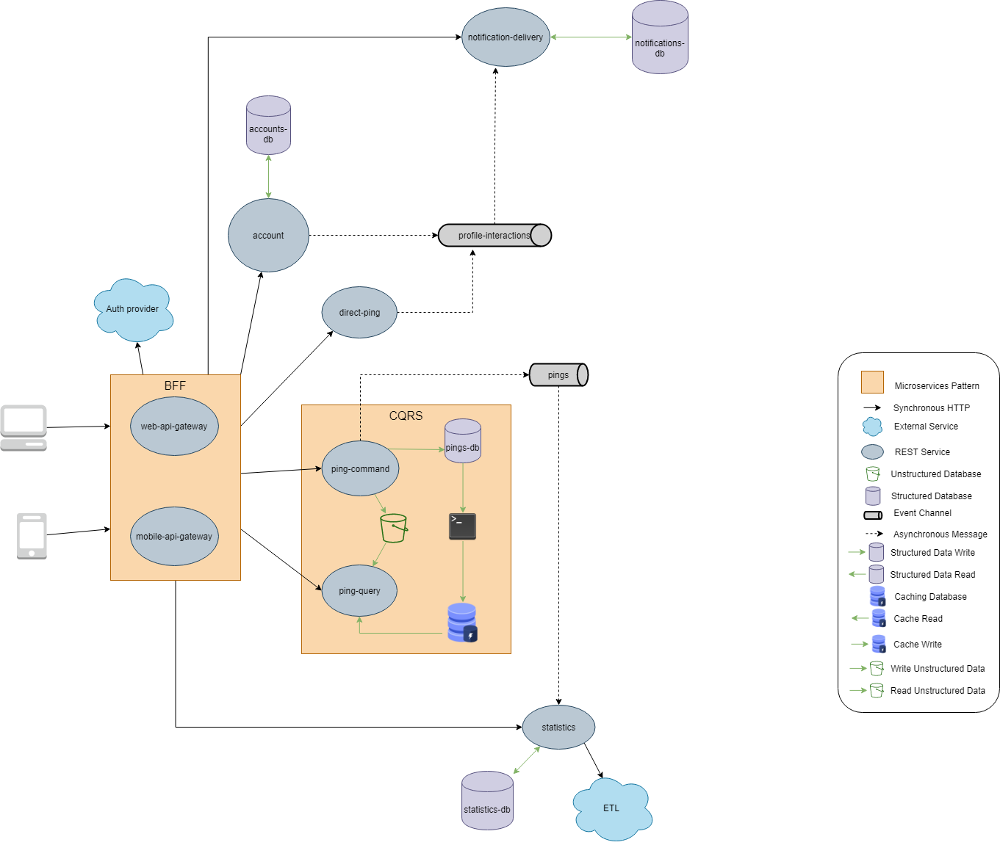
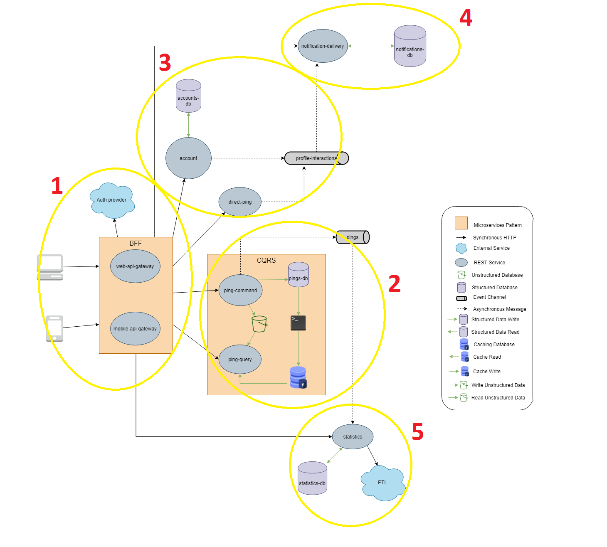
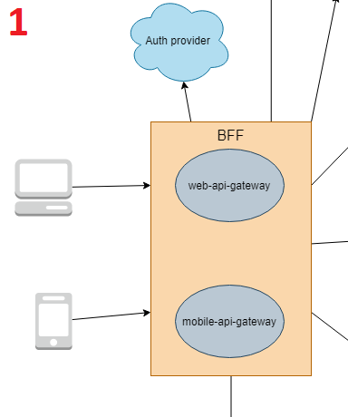
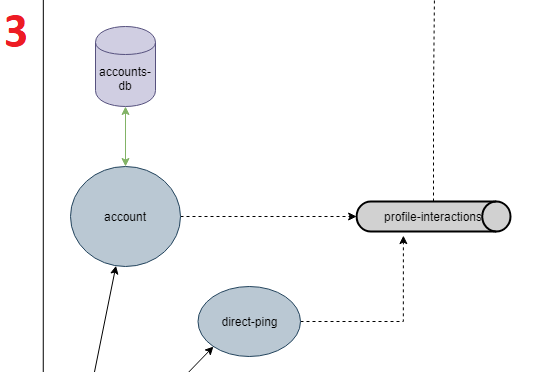
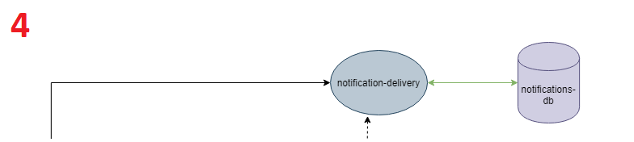
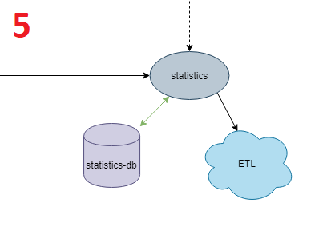

# PROGRAMA DE VERÃO DO IME-USP (2021 - edição 50)

## Curso: Arquitetura Ágil de Software - EaD - Período: 18/01/2021 a 26/02/2021

Professores: **João Francisco Lino Daniel, Thatiane de Oliveira Rosa e Wander Souza**

### Membros do time E

* [Denilson Costa Dias](https://github.com/denilsoncd)
* [Guilherme Martelato Campos](https://github.com/guilhermemcampos)
* [Marcos Barbosa de Castro](https://github.com/marbarbosa)
* [Renan Marcos Ferreira](https://github.com/renanmarcos)
* [Vanderlin Júnior](https://github.com/Wanderllin)
* [Victor Eduardo Próspero](https://github.com/victorprospero)

## Pingr

Solução arquitetural criada pela equipe E para a rede social "Pingr", um microblog fictício parecido com o Twitter. Trabalhamos como uma consultoria técnica para modelar algo que se adequasse ao momento de ascensão da startup e implementando uma prova de conceito.

## Contexto do problema

Destrinchamos o [enunciado original](docs/enunciado-original.pdf) do projeto em [histórias de usuário](docs/historias-usuario.md) para facilitar o entendimento e compreensão do contexto do problema. Foi identificado também [atributos de qualidade](docs/atributos-qualidade.md) que não estavam diretamente relacionados a uma história de usuário.

## Solução adotada

Acreditamos que o modelo de microsserviços se encaixou perfeitamente no contexto por proporcionar maior granularidade no espaço da solução, fornecendo confortavelmente flexibilidade para um produto que pode mudar constantemente e de maneira veloz, como podemos perceber já que existe expectativa de crescimento tão grande tanto na equipe quanto na base de usuários que tende a ser multinacional. Com essa arquitetura, a Lei de Conway pode ser facilmente observada ao atribuir pequenos times para cuidar de cada sistema e dar um suporte contínuo e de alta qualidade em cada ponto. Além disso, a possibilidade de utilizar o canary deployment e de realizar implantação em cada microsserviço de forma separada corrobora com a necessidade de manter a solução online 24h. Em suma, todos os requisitos não funcionais guiaram essa decisão.

Em contrapartida, existe uma complexidade grande envolvida nesse tipo de solução que pode ser um risco quando mal aplicada, por isso é crucial o bom planejamento em cada decisão. Explicamos a partir daqui como fizemos o processo de descoberta de cada microsserviço, quais padrões foram escolhidos e por que escolhemos cada um.

### Padrões de microsserviços adotados

* [CQRS - Command Query Responsibility Segregation](docs/patterns/cqrs.md)
* [Asynchronous message](docs/patterns/async-message.md)
* [EDA - Event Driven Architecture](docs/patterns/eda.md)
* [BFF - Backends For Frontends](docs/patterns/bff.md)

## 4. Respondendo a que perguntas do Projeto **Projeto Pingr**

**TRADE OFF dos Pings**

  Como a equipe de desenvolvimento vai crescer e os pings são muito importantes para os usuários.  
  Aplicamos o padrão de arquitetura CQRS para os Pings.  
  Onde teremos um microsserviço chamado ping-query, que fará todas as consultas em um repositório replicado.  
  E outro microsserviço chamado ping-command, onde faremos todas as postagens de pings dos usuários com um banco próprio.  
  Entre os dois microsserviços existirá um mecanismo de ETL que irá gravar na base do "ping-query" de forma estruturada as informações para as consultas apropriadas a esse serviço.  
  A seguir algumas definições da história do usuário.  

* Ping Privado
 
  Um ping privado é visto somente por usuários que seguem a minha conta.  
  Um ping de uma conta privada, pode ser alterada para pública e visto por outros usuários e por visitantes.  

* Ping Público

  Eu, como visitante, gostaria de visualizar pings públicos.  
  Um ping público é visto por outros usuários e por visitantes.  
  Quando minha conta é pública, todos os meus novos pings entrarão com a visibilidade “público”.  

* Ping

  Pode levar até 15 segundos para aparecer meu novo ping para mim.  
  Eu, como usuário, gostaria de classificar meus pings em até 10 hashtags.  
  Eu, como usuário, gostaria de anexar imagens em um ping.  
  Eu, como usuário, gostaria de responder pings. Podendo responder o próprio ping ou ping de outras pessoas.  
  Eu, como usuário, gostaria de curtir um ping.  
  Eu, como usuário, gostaria de compartilhar um ping. Essa ação é chamada de pong.  

* Mesa Principal

  Eu, como usuário, gostaria de visualizar pings na mesa principal (timeline).  
  É possível visualizar os próprios pings ou de outros usuários.  
  Pode demorar até 3 minutos no máximo para aparecer novos pings de outros usuários nas mesas.  
  Ao seguir um usuário, todos os novos pings publicados por ele e os antigos são exibidos nas mesas.  
  Os pings classificados com a hashtag seguida são exibidos nas mesas.  

* Mesa Personalizada

  Eu, como usuário, gostaria de visualizar pings utilizando filtros e salvar isso como uma mesa personalizada.  
  Posso ter no máximo 3 mesas personalizadas.  
  As mesas personalizadas só são visualizadas no cliente web.  
  Usar como filtro hashtags e/ou nomes de usuários.  
  Ao seguir um usuário, todos os novos pings publicados por ele e os antigos são exibidos nas mesas.  
  Os pings classificados com a hashtag seguida são exibidos nas mesas.  

* Consulta pings por HashTag

  Eu, como usuário, gostaria de visualizar pings associados a um hashtag (busca de hashtags).  
  Na lista das TgNW e TgNH Ao clicar para visualizar uma hashtag, a busca por pings com ela é disparada.  

## 5. Arquitetura desenvolvida para Pingr
**Macro Arquitetura para Pingr:**

**Detalhes Arquitetura para Pingr:**

**Detalhes 1 Arquitetura para Pingr:**

**Detalhes 2 Arquitetura para Pingr:**

**Detalhes 3 Arquitetura para Pingr:**

**Detalhes 4 Arquitetura para Pingr:**

**Detalhes 5 Arquitetura para Pingr:**

## 6. Justificativas para o uso de CQRS

• Dimensionamento independente. O CQRS permite que as cargas de trabalho de leitura e gravação sejam dimensionadas de forma independente e pode resultar em menos contenções de bloqueio.

• Esquemas de dados otimizados. O lado de leitura pode usar um esquema que é otimizado para consultas, enquanto o lado de gravação usa um esquema que é otimizado para atualizações.

• Segurança. É mais fácil garantir que apenas as entidades do direito de domínio estejam executando gravações nos dados.

• Separação de preocupações. Isolar os lados de leitura e gravação pode resultar em modelos mais flexíveis e sustentáveis. A maior parte da lógica de negócios complexa vai para o modelo de gravação. O modelo de leitura pode ser relativamente simples.

• Consultas mais simples. Ao armazenar uma exibição materializada no banco de dados de leitura, o aplicativo poderá evitar junções complexas durante as consultas.
xxx
