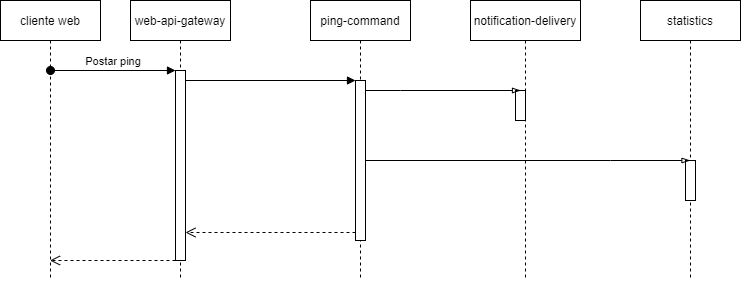
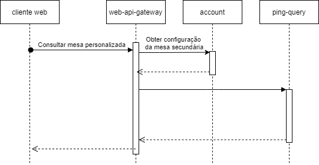

# L PROGRAMA DE VERÃO DO IME-USP (2021 - edição 50)  

## Curso: Arquitetura Ágil de Software - EaD - Período: 18/01/2021 a 26/02/2021

Professores: **João Francisco Lino Daniel, Thatiane de Oliveira Rosa e Wander Souza**

### Membros do time E

* [Denilson Costa Dias](https://github.com/denilsoncd)
* [Guilherme Martelato Campos](https://github.com/guilhermemcampos)
* [Marcos Barbosa de Castro](https://github.com/marbarbosa)
* [Renan Marcos Ferreira](https://github.com/renanmarcos)
* [Vanderlin Júnior](https://github.com/Wanderllin)
* [Victor Eduardo Próspero](https://github.com/victorprospero)

## Pingr

Solução arquitetural criada pela equipe E para a rede social "Pingr", um microblog fictício parecido com o Twitter. Trabalhamos como uma consultoria técnica para modelar algo que se adequasse ao momento de ascensão da startup e implementando uma prova de conceito.

## Contexto do problema

Destrinchamos o [enunciado original](docs/enunciado-original.pdf) do projeto em [histórias de usuário](docs/historias-usuario.md) para facilitar o entendimento e compreensão do contexto do problema. Foi identificado também [atributos de qualidade](docs/atributos-qualidade.md) que não estavam diretamente relacionados a uma história de usuário.

## Solução adotada

Acreditamos que o modelo de microsserviços se encaixou perfeitamente no contexto por proporcionar maior granularidade no espaço da solução, fornecendo confortavelmente flexibilidade para um produto que pode mudar constantemente e de maneira veloz, como podemos perceber já que existe expectativa de crescimento tão grande tanto na equipe quanto na base de usuários que tende a ser multinacional. Com essa arquitetura, a Lei de Conway pode ser facilmente observada ao atribuir pequenos times para cuidar de cada sistema e dar um suporte contínuo e de alta qualidade em cada ponto. Além disso, a possibilidade de utilizar o canary deployment e de realizar implantação em cada microsserviço de forma separada corrobora com a necessidade de manter a solução online 24h. Em suma, todos os requisitos não funcionais guiaram essa decisão.

Em contrapartida, existe uma complexidade grande envolvida nesse tipo de solução que pode ser um risco quando mal aplicada, por isso é crucial o bom planejamento em cada decisão. Explicamos a partir daqui como fizemos o processo de descoberta de cada microsserviço, quais padrões foram escolhidos e por que escolhemos cada um.

### Visão arquitetural da solução

A partir das histórias de usuários, identificamos os principais elementos que compõe a solução e os organizamos em microsserviços por subdomínio, observando as responsabilidades que podem ser atribuídas a cada equipe e garantindo que eles possam evoluir e ser entregues com elevado grau de independência.  

As responsabilidades de cada microsserviço são:

* web-api-gateway 
    * Ponto central para atender as requisições feitas por navegadores de internet de desktops (clientes web);
    * Disponibiliza funcionalidades exclusivas para clientes web, como a consulta de mesas secundárias;
    * Orquestra as chamadas para múltiplos microsserviços, quando necessário, para atender os cenários de uso;
* mobile-api-gateway
    * Ponto central para atender as requisições feitas por aplicativos de smartphones;
    * Disponibiliza funcionalidades exclusivas para clientes móveis (apps), como a consulta de nuvens de palavras locais (TagNow Here);
    * Fornece pontos de conexão (endpoints) otimizados para conexões lentas (redes 2g, 3g, etc); 
    * Orquestra as chamadas para múltiplos microsserviços, quando necessário, para atender os cenários de uso;
* account
    * Permite a gestão da conta dos usuários, permitindo o ajuste da visibilidade de perfil ( público e privado) e a visibilidade padrão dos pings publicados;
    * Permite a criação listas de amigos especiais com usuários específicos;
    * Permite armazenar as configurações de exibição de mesas segundárias e de usuários seguidos pela conta de usuário; 
* direct-ping
    *  Permite a comunicação privada entre usuários através de mensagens;
* ping-command
    * Permite a publicação de pings, o seu compartilhamento (pongs) e a resposta a eles;
* ping-query
    * Permite a consulta de pings para a mesa principal e mesas secundárias (personalizadas);
    * Permite a busca de pings marcados com hashtags
* statistics
    * Gera nuvens de hashtags (TagNow) com base nos pings publicados e na sua localização;
    * Permite a consulta das hashtags TagNow Here e TagNow World;
* notification-delivery
    * Registra notificações a partir de eventos gerados por outros microsserviços (ex: solicitação para seguir um perfil, menção em ping, recebimento de direct-ping, etc) para informar aos usuários posteriormente;
    * Permite a consulta de notificações geradas para cada usuário;
    * Envia notificações push para celulares

A visão arquitetural a seguir ilustra os microsserviços mencionados e suas interações em tempo de execução, cobrindo as funcionalidades previstas para o Pingr.

O diagrama de sequência a seguir ilustra como diferentes serviços interagem entre si para permitir a publicação de um ping em que um usuário menciona outro, o qual deverá ser notificado.

O próximo diagrama de sequência mostra a interação entre os serviços para permitir a consulta de pings em uma mesa personalizada (mesa secundária).

### Padrões de microsserviços adotados

* [CQRS - Command Query Responsibility Segregation](docs/patterns/cqrs.md)
* [Asynchronous message](docs/patterns/async-message.md)
* [EDA - Event Driven Architecture](docs/patterns/eda.md)
* [BFF - Backends For Frontends](docs/patterns/bff.md)
* [API Gateway](docs/patterns/api-gateway.md)
* [Database per Service](docs/patterns/database-per-service.md)

### Implementação

Como prova de conceito, fizemos um recorte dos microsserviços que compõe a solução para demonstrar a implementação de alguns do principais padrões arquiteturais utilizados.

Para demonstrar o funcionamento do CQRS, foi feita uma implementação básica dos microsserviços ping-command e ping-query. Para exemplificar o funcionamento do API Gateway, foi feita uma implementação básica do web-api-gateway. E para demonstrar o funcionamento do asynchronous message para interação entre serviços, foram implementados de forma bem simples os microsserviços account e notification-delivery.

### Account

Permite a gestão da conta dos usuários, permitindo o ajuste da visibilidade de perfil 
(público e privado) e a visibilidade padrão dos pings publicados;
Permite a criação listas de amigos especiais com usuários específicos;
Permite armazenar as configurações de exibição de mesas secundárias e de usuários seguidos pela conta de usuário;

Escopo da implementação 

Quando um usuario começa a seguir outro, uma notificação é gerada para seguido,
neste processo o serviço account recebe a notificação de "NewFollower" e faz a 
indexação entre os dois usuarios, gerando ao fnal uma mensagem representara por um 
arquivo JSON e direcionado para o canal "profile-interactions", que por sua vez se 
encarregua de informar ao usuario seu novo seguidor. 

LIST ACCOUNT:
http://localhost:8090/ime-rest/rest/service/list

ID: 
http://localhost:8090/ime-rest/rest/service/id/get/1
http://localhost:8090/ime-rest/rest/service/id/get/2
http://localhost:8090/ime-rest/rest/service/id/get/3
http://localhost:8090/ime-rest/rest/service/id/get/4
http://localhost:8090/ime-rest/rest/service/id/get/5
http://localhost:8090/ime-rest/rest/service/id/get/6

USER: 
http://localhost:8090/ime-rest/rest/service/user/get/DCD
http://localhost:8090/ime-rest/rest/service/user/get/VDLN
http://localhost:8090/ime-rest/rest/service/user/get/RF
http://localhost:8090/ime-rest/rest/service/user/get/VC
http://localhost:8090/ime-rest/rest/service/user/get/GUILH
http://localhost:8090/ime-rest/rest/service/user/get/MR

NEW FOLLOW: 
http://localhost:8090/ime-rest/rest/service/followdestination/get/VDLN
http://localhost:8090/ime-rest/rest/service/followdestination/get/RF
http://localhost:8090/ime-rest/rest/service/followdestination/get/VC
http://localhost:8090/ime-rest/rest/service/followdestination/get/GUILH
http://localhost:8090/ime-rest/rest/service/followdestination/get/MR

### Conclusão

