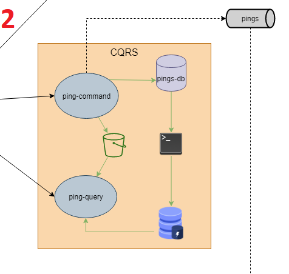

# CQRS - Command Query Responsibility Segregation

## Decisão

Até 4 meses atrás, a empresa Pingr investiu apenas no público latino-americano. Desde então, a rede social está expandindo para outras regiões do planeta. Até julho de 2022, o plano é de ter presença em países de todos os continentes.
O Pingr é acessado maciçamente por seu público ao longo das 24 horas do dia. E as pesquisas de aceitação demonstraram que os usuários toleram alguns delays, como:
- Pings próprios podem levar até 15s para aparecerem para si.
- Pings de outros podem demorar até 3 minutos para aparecer na(s) sua(s) mesa(s);

Para poder atender o público dentro da expectativa do tempo, e tornar as implementações e manutenções mais ágeis para o objetivo central da aplicação, que é o ping, decidimos desmembrar o microsserviço Ping implementando o padrão de arquitetura CQRS no mesmo.

Usamos esse padrão nos microsserviços:

* Ping-Command
* Ping-Query

## Consequências

Por conta da separação da responsabilidade de escrita e leitura de seus dados, podemos visualizar algumas consequências positivas e negativas.

Pontos Positivos:
- Como será uma base de dados para cada microsserviço, teremos uma melhora na performance do banco e na aplicação
- Aumenta a disponibilidade e escalabilidade da aplicação
- Os microsserviços podem ser em linguagens diferentes

Pontos Negativos:
- Por ter base de dados separado, maior responsabilidade e complexidade para alteração em tabela e representação de dados nos diferentes microsserviços
- Uma estrutura de infra maior
- Cuidado e atenção especial no gerenciamento da ferramenta de replicação das informações entre as bases.

## Justificativas para o uso de CQRS

• Dimensionamento independente. O CQRS permite que as cargas de trabalho de leitura e gravação sejam dimensionadas de forma independente e pode resultar em menos contenções de bloqueio.

• Esquemas de dados otimizados. O lado de leitura pode usar um esquema que é otimizado para consultas, enquanto o lado de gravação usa um esquema que é otimizado para atualizações.

• Segurança. É mais fácil garantir que apenas as entidades do direito de domínio estejam executando gravações nos dados.

• Separação de preocupações. Isolar os lados de leitura e gravação pode resultar em modelos mais flexíveis e sustentáveis. A maior parte da lógica de negócios complexa vai para o modelo de gravação. O modelo de leitura pode ser relativamente simples.

• Consultas mais simples. Ao armazenar uma exibição materializada no banco de dados de leitura, o aplicativo poderá evitar junções complexas durante as consultas.

