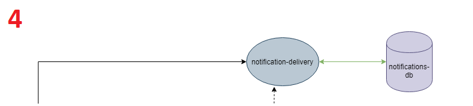

# EDA - Event Driven Architecture

## Decisão (Como cheguei a escolher essa decisão?)

Uma Arquitetura Orientada a Eventos (EDA – Event Driven Architecture) utiliza de mudanças de estado (eventos) para disparar comunicações assíncronas e é comum em aplicações modernas baseadas em microsserviços, é um paradigma de arquitetura de software que promove a produção, detecção, consumo e reação a eventos.
Um evento pode ser definido como "uma mudança significativa no estado". Como por exemplo, no Projeto Pingr, tanto web quanto mobile têm um menu específico para listar as notificações, ordenadas da mais recente para a mais antiga. As notificações são diferenciadas entre “lidas” e “não lidas”, pode tratar essa mudança de estado como um evento cuja ocorrência pode ser divulgada para outros aplicativos da arquitetura. De uma perspectiva formal, o que é produzido, publicado, propagado é uma notificação (geralmente assíncrona) chamada de notificação de evento, e não o próprio evento.  Clientes mobile têm suporte a notificações PUSH que são enviadas assim que a ação ocorre (interação com pings, DPs, etc); 

Neste exemplo, existe o ping ao usuário, que é responsável por alterar os dados e disparar o evento de mudança de endereço na fila, após o que o ping ao cliente segue seu fluxo normal. O mediador do evento pode ser avisado da chegada de um evento, ou até mesmo verificar a fila de novas informações, tudo depende de como você decidir implementá-lo. O mediador, que conhece o fluxo que o evento deve seguir, notificará primeiro o serviço de envio do ping.

O mediador verificará se ocorreu alteração na cotação e, caso tenha ocorrido, o serviço de notificação é o próximo na fila a receber o evento e será responsável por notificar o cliente da alteração da tarifa do seguro. Se o valor não foi alterado, o fluxo de eventos termina ali. O mediador pode ser implementado, por exemplo, com Apache Camel ou Spring Integration.

A Event-Driven Architecture - ou EDA, como é conhecida por amigos mais próximos - é um padrão arquitetônico que promove a produção, detecção, consumo e reação a eventos de negócios.

EDA é uma forma de realizar a comunicação entre sistemas que consiste principalmente em operações assíncronas, além de permitir aplicações mais escalonáveis ​​e gerar menos acoplamento entre serviços, permitindo assim uma arquitetura altamente flexível .

É um modelo que não depende do tamanho da sua arquitectura, ou seja, ele pode ser adaptado para sistemas de qualquer tamanho. Existem três componentes importantes do EDA:

  * Gerador (es) de eventos; Evento: um evento normalmente representa uma mudança de estado: um pedido foi feito, um funcionário foi contratado, uma conta foi paga. O evento é algo que aconteceu portanto, preferencialmente, o seu nome deve ter um verbo no passado;

  * Mediador ou corretor; Producers: quem publica um evento. Exemplo: um front-end de e-commerce publica um evento OrderReceived;

  * Consumidores de eventos; Consumers: quem ouve os eventos. Por exemplo, um microsserviços de estoque deve ouvir o evento OrderReceived para fazer a baixa do estoque

Aqui nesse ponto podemos ver a viabilidade de Events Notifications, e como podemos equalizar todas as ocorrências através de uma única chamada. Basicamente, no ato de uma compra o(s) evento(s) é(são) disparado(s) e apenas os sistemas interessados em cada tipo de evento serão acionados, disparando um GET para receber tais informações.

**E quais são os principais princípios desta arquitetura?**
  * EDA relata eventos atuais: as notificações devem sempre relatar um incidente .
  * EDA envia notificações: as notificações devem ser enviadas do gerador de eventos para os processadores, e não o contrário.
  * EDA responde imediatamente: o processador deve sempre agir imediatamente após receber a notificação, mesmo que a ação signifique não fazer nada.
  * A comunicação flui apenas em uma direção: as notificações devem seguir o estilo “disparar e esquecer”, pelo qual o gerador enviará a notificação e seguirá seu fluxo normalmente, não aguardando o processamento do evento pelo processador. A preocupação com os processadores que recebem a notificação com sucesso passa a ser responsabilidade da fila ou do mediador.
  * É livre de comandos: uma notificação informa a ocorrência de um evento. Não deve dizer o que deve fazer o processador que receberá o evento; cada processador deve saber o que fazer com o evento.

**Usamos esse padrão em tais microsserviços:**

* **Microsserviço: notification-delivery**

 
## Consequências (Descrever pontos positivos e negativos de ter escolhido esse padrão)

O principal valor agregado ao negócio ao adotar-se EDA (Event-driven Architecture) seria a facilidade de estender o ecossistema com novos componentes, de forma modular, prontos para reagir a eventos existentes ou produzir novos sem o risco de comprometer as implementações existentes e seu funcionamento.

EDA promove o baixo acoplamento dos componentes no sentido de que para atender novas funcionalidades emergentes de requisitos de negócio no futuro simplesmente acrescentamos o novo componente que passará a escutar e reagir aos eventos existentes. Uma sequência relacionada e ordenada de eventos reflete um comportamento (geralmente chamado de Stream) na linha do tempo.

Eventos, dentro do EDA, podem ser de dois tipos: Event Notification ou Event-Carried State Transfer. Sendo que no padrão Event Notification o evento apenas encarrega-se de notificar, de forma simples, que algo relevante ocorreu e que uma reação relacionada a este acontecimento pode ser desencadeada.
